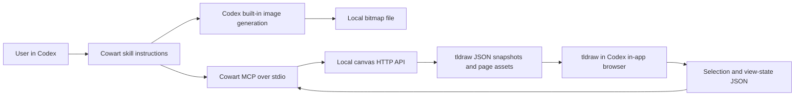
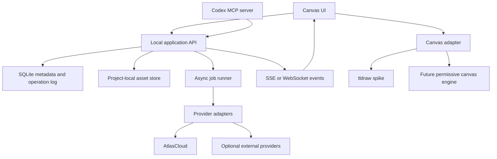

# Cowart Reverse Engineering and Atlas Canvas Proposal

Research snapshot: 2026-06-23

Sources:

- [Cowart repository](https://github.com/zhongerxin/Cowart), source snapshot `43134e9`
- [Original X demo](https://x.com/cellinlab/status/2068193900570046502)
- [Atlas development research](https://atlascloud.sg.larksuite.com/wiki/Kh0qw91amioM92kszPZlVSImgeO), revision 8
- [tldraw SDK license](https://tldraw.dev/community/license)
- Public Cowart issues and pull requests as of the research date

## Executive conclusion

Cowart is a small and effective Codex integration, not a media-generation platform. Its core is:

1. a local tldraw app;
2. project-local JSON and asset persistence;
3. two MCP tools for reading selection and inserting an image;
4. three Codex skills that tell the agent how to open the canvas, generate an image, and interpret an annotation screenshot.

The image model is not called by Cowart. Codex calls its own image-generation tool, saves a bitmap, then Cowart inserts that bitmap into the canvas. This explains both the project's simplicity and its main limitation: it has no provider abstraction, job orchestration, durable generation metadata, or native video/3D model.

The recommended product is therefore not a line-by-line Cowart fork. It should be a clean-room implementation of the interaction pattern, with a media job system and asset lineage at the center. The initial positioning is:

> An agent-native infinite canvas that turns an idea into images, video, and 3D, with frame-level visual feedback and traceable versions. Powered by AtlasCloud, but open to other providers.

## Important legal boundary

Cowart currently has no repository license. Public source is not the same as permission to copy, modify, or redistribute. Do not copy its code into this project unless the author adds a suitable license or grants permission.

The safe path is clean-room implementation from observed behavior and public interfaces:

- reproduce the user workflow, not Cowart source code;
- write new types, storage, MCP tools, skills, UI, and tests;
- keep this research document as the functional reference;
- avoid Cowart names, logos, screenshots, and source-derived identifiers in the released product.

tldraw has a separate licensing constraint. Its SDK permits development by default, but production use requires a trial, commercial, or hobby license key. An open repository can depend on tldraw, but downstream production users still need their own applicable tldraw license. This should be resolved before calling the final product fully open source.

Recommended decision gate:

- use tldraw for the fastest technical spike;
- before public beta, either purchase/obtain the appropriate tldraw license or replace the canvas engine with a permissively licensed stack;
- make the canvas adapter replaceable so this decision does not infect the media and agent layers.

## Current Cowart facts

At the time of research, the repository was created on 2026-06-18 and had 1,893 stars, 147 forks, and 7 open issues/PRs. It has no GitHub description, topics, releases, CI workflow, tests, or declared repository license. The current package version is `0.1.2`.

The locked source builds successfully with Node/npm:

```text
npm ci
npm run build
vite v7.3.5
838 modules transformed
dist JavaScript: 1,889.43 kB, 573.02 kB gzip
1 low-severity npm audit finding
```

The main implementation is compact but highly concentrated:

| Area | File | Size | Responsibility |
|---|---|---:|---|
| Canvas UI | `src/App.jsx` | 1,025 lines | tldraw UI, AI holder, annotation tool, selection/view sync, autosave, SSE refresh |
| MCP server | `mcp/server.mjs` | 651 lines | JSON-RPC over stdio, selection read, local image insertion |
| Local storage server | `vite.config.js` | 627 lines | Vite middleware, JSON persistence, asset localization, SSE |
| Agent behavior | `skills/*/SKILL.md` | 376 lines | open, image generation, screenshot-driven image edit |

## How Cowart actually works



### Browser and storage bridge

The Vite development server doubles as the application's local backend. It exposes:

- `GET/PUT /api/canvas` for the whole tldraw snapshot;
- `GET/PUT /api/selection` for the selected shape summary;
- `GET/PUT /api/view-state` for page and camera state;
- `GET /api/canvas-events` for server-sent refresh events;
- page-local routes for image assets.

The browser autosaves the whole document snapshot after user changes. Selection is polled and persisted every 250 ms; view state every 500 ms. MCP writes a changed snapshot through the HTTP API, which emits an SSE event so the browser refreshes.

Canvas data is stored under the active user project, not the plugin checkout:

```text
canvas/
  cowart-selection.json
  cowart-view-state.json
  pages/
    manifest.json
    <page-id>/
      cowart-canvas.json
      assets/
```

### Agent contract

Cowart exposes only two MCP tools:

- `get_cowart_selection`: reads the persisted selected shapes and image asset metadata;
- `insert_cowart_image`: copies a local bitmap into page assets, creates tldraw asset/shape records, chooses a non-overlapping position, and saves the canvas.

The apparent intelligence lives in skills. For annotation edits, the user must provide a screenshot. The skill tells Codex to visually interpret arrows and labels, generate a clean revised bitmap, preserve the original, and insert the new result to the right.

This is a clever contract because it avoids building annotation parsing, model routing, or media generation into the app. It is also brittle because behavior depends on prose instructions and the capabilities of the current host agent.

### What is worth preserving

- Project-local assets make agent file access simple and inspectable.
- A selected holder is a good spatial contract for aspect ratio and placement.
- Keeping the original and placing revisions beside it makes iteration legible.
- The browser and MCP share a small, explicit state surface.
- Skills separate user intent from low-level tldraw record mutation.
- The local-first experience requires almost no account setup.

### What should not be preserved

- Do not let multiple writers replace the full canvas snapshot without revisions or transactions.
- Do not encode the entire media workflow only in skill prose.
- Do not make screenshot upload the only way to describe annotation context.
- Do not treat image, video, and 3D as incidental tldraw assets with no shared metadata.
- Do not couple persistence to Vite middleware for a product expected to run long asynchronous jobs.
- Do not make Codex's built-in image model the implicit provider.

## Known problems revealed by the repository

Public issues and source review expose the main engineering risks:

1. **Whole-snapshot corruption:** one invalid tldraw record can make the entire canvas fail validation and white-screen. There is no per-record quarantine or last-known-good recovery.
2. **Lost-update races:** the project already needed a fix for pasted images being overwritten by a stale remote snapshot during SSE refresh.
3. **Asset filename collisions:** pasted assets can reuse display names; Cowart added fallback naming to prevent overwrites.
4. **Dependency/install fragility:** several early PRs repair missing direct dependencies and MCP startup after plugin installation.
5. **Weak holder controls:** users immediately asked for holder size/aspect-ratio controls.
6. **Provider confusion:** users assume Cowart can select models, but it only delegates to the host's built-in image generation.
7. **No tests or CI:** build success is the only visible automated quality signal.
8. **No authentication boundary:** local endpoints accept reads and writes from any process able to reach the loopback port.

## Proposed product architecture

The central abstraction should be a versioned media asset, not a tldraw image shape.



Recommended packages:

```text
apps/canvas-web/          React + TypeScript canvas UI
apps/local-server/        local HTTP API and job runner
packages/canvas-adapter/  engine-neutral canvas operations
packages/media-core/      assets, versions, annotations, jobs, lineage
packages/providers/       Atlas and optional provider adapters
packages/mcp-server/      host-agent tools over stdio
plugins/codex/            plugin metadata and user-facing skills
```

The first release may run everything in one local Node process, but the module boundaries should exist from day one.

## Core data model

```ts
type MediaKind = 'image' | 'video' | 'model3d'
type JobStatus = 'queued' | 'running' | 'succeeded' | 'failed' | 'cancelled'

interface MediaAsset {
  id: string
  kind: MediaKind
  path: string
  mimeType: string
  width?: number
  height?: number
  durationMs?: number
  createdAt: string
}

interface MediaVersion {
  id: string
  assetId: string
  parentVersionIds: string[]
  operation: 'generate' | 'edit' | 'variation' | 'frame-edit' | 'convert'
  provider: string
  model: string
  prompt: string
  parameters: Record<string, unknown>
  annotationSetId?: string
  jobId: string
}

interface AnnotationSet {
  id: string
  sourceVersionId: string
  frameTimeMs?: number
  coordinateSpace: { width: number; height: number }
  items: AnnotationItem[]
}

interface GenerationJob {
  id: string
  type: 'image.generate' | 'image.edit' | 'video.generate' | 'video.edit' | 'model3d.generate'
  status: JobStatus
  progress?: number
  providerJobId?: string
  inputVersionIds: string[]
  outputVersionIds: string[]
  error?: { code: string; message: string; retryable: boolean }
}
```

Every canvas media shape should hold only stable references such as `mediaVersionId`, presentation bounds, playback state, and selected 3D camera state. Provider URLs and expiring outputs must be copied into the project asset store before a job succeeds.

## Video workflow

### Generation

Image-to-video and text-to-video should be asynchronous jobs. The canvas inserts a pending card immediately, shows provider/model/cost/ETA, and replaces the preview when the durable local result arrives.

### Frame-level feedback

The user-facing interaction should be:

1. pause the video at a frame;
2. click `Annotate frame`;
3. capture a clean local frame and create an annotation layer tied to `videoVersionId + frameTimeMs`;
4. draw arrows, masks, and notes in frame coordinates;
5. ask the agent to revise the shot;
6. place the revised video beside the original and preserve both versions.

The system must store annotations as structured vector data and also render a composite PNG for vision models. This is more reliable than asking the agent to infer intent from an arbitrary whole-window screenshot.

### Honest editing boundary

"Edit this frame, then edit the video" is not one universal operation. The product should expose three explicit strategies:

- **Native video edit:** use a provider's video-to-video/inpainting API when available.
- **Keyframe-guided regeneration:** edit the selected frame, then use it as a start/reference frame to regenerate the shot.
- **Shot replacement:** cut a time range, regenerate that segment, and stitch it back with the original audio when model/API support is limited.

The MVP should promise shot revision, not arbitrary frame-perfect video retouching. Frame-only edits can create temporal flicker or identity drift unless the underlying provider supports temporal consistency.

Useful server-side media operations include frame extraction, proxy generation, thumbnails, duration probing, clip splitting, and stitching. These should be isolated behind a media service so an ffmpeg dependency remains optional and explicit.

## 3D workflow

Image-to-3D should generate a durable `.glb`/`.gltf` asset plus preview thumbnails. A custom canvas shape can render the model with a dedicated viewer and persist camera position, lighting preset, animation state, and selected material/part.

3D annotation should operate on a rendered view:

1. freeze the current camera;
2. capture a view image with camera metadata;
3. annotate the 2D capture;
4. translate feedback into one of three operations: regenerate geometry, regenerate texture/material, or produce a new reference image before another image-to-3D pass;
5. keep the new model as a child version beside the source.

Do not imply that a generative model can deterministically edit arbitrary mesh topology. Direct vertex/rig/UV editing is a separate future feature and likely belongs in a specialized 3D editor.

## Proposed MCP surface

Cowart's two tools are sufficient for images but too narrow for multimodal workflows. A useful first tool set is:

```text
canvas.open
canvas.get_selection
canvas.get_context
canvas.create_holder
canvas.place_media
canvas.create_comparison

media.generate_image
media.edit_image
media.generate_variations
media.generate_video
media.edit_video
media.generate_3d
media.get_job
media.cancel_job

annotation.get_context
annotation.capture_video_frame
annotation.render_composite

version.get_lineage
version.restore
```

Tool results should be structured and return stable IDs, local paths, job status, canvas placement, model/provider metadata, and estimated/actual cost. Long-running tools should return a job immediately; the canvas listens for completion events.

The provider layer can expose Atlas as the default without hard-coding it into the canvas protocol:

```ts
interface MediaProvider {
  capabilities(): Promise<ProviderCapabilities>
  submit(request: MediaRequest): Promise<SubmittedJob>
  poll(job: SubmittedJob): Promise<ProviderJobState>
  cancel?(job: SubmittedJob): Promise<void>
  materialize(result: ProviderResult, destination: string): Promise<LocalAsset>
}
```

## Reliability and security requirements

- Use server-authoritative operations with monotonic revisions, not blind whole-snapshot replacement.
- Persist an operation log and last-known-good snapshot; support automatic recovery and manual rollback.
- Validate every imported record and quarantine invalid records with a visible warning.
- Write JSON and assets atomically; never overwrite an existing asset unless the operation is explicitly replace.
- Restrict all filesystem paths to the active project root and reject symlink/path traversal escapes.
- Bind locally, use an unguessable per-session token, and validate origin for browser requests.
- Apply file size, MIME type, duration, polygon count, and job concurrency limits.
- Never expose Atlas keys to the browser; keep credentials in the server process/keychain.
- Treat remote model URLs as untrusted; guard against SSRF and materialize outputs promptly.
- Record cost estimates before submission and actual provider cost when available.
- Add deterministic migrations for both media metadata and canvas records.

## MVP and roadmap

### Phase 0: legal and technical spike, 2-3 days

- Ask Cowart's author to add a license or confirm clean-room boundaries.
- Confirm tldraw licensing cost/terms for Atlas and OSS downstream users.
- Spike tldraw and one permissive alternative behind a tiny canvas adapter.
- Verify Atlas image generation, image edit, image-to-video, and image-to-3D APIs, including polling and output expiry.
- Define the Codex plugin installation path and local credential flow.

Exit criterion: one holder can receive a durable Atlas-generated image without copying Cowart code.

### Phase 1: image MVP, about 1 week

- Infinite canvas, resizable aspect-ratio holders, paste/upload, local persistence.
- Atlas image generate/edit/variations with asynchronous job cards.
- Structured annotation layer and rendered composite.
- Before/after placement and version lineage.
- Codex plugin with MCP tools and three focused skills.
- Crash recovery, snapshot validation, basic tests, and CI.

Exit criterion: reproduce the viral image workflow with Atlas-selected models and reliable recovery.

### Phase 2: video MVP, about 1-2 weeks

- Video asset/player shape and local proxy/thumbnail generation.
- Frame capture at exact timestamp and annotation binding.
- Image-to-video plus at least one honest shot-revision strategy.
- Job progress, cancellation, retry, cost display, and version comparison.

Exit criterion: annotate one paused frame and generate a traceable revised shot beside the original.

### Phase 3: 3D MVP, about 1 week

- Image-to-3D job and GLB materialization.
- Interactive model viewer shape with persistent camera state.
- View capture, annotation, regeneration, and side-by-side versions.

Exit criterion: turn a canvas image into a viewable 3D asset and iterate once from annotated feedback.

### Phase 4: public open-source launch

- Resolve canvas license and select project license.
- Security review, telemetry opt-in, contribution guide, changelog, roadmap, examples.
- English-first README with a short demo GIF/video and a 60-second local quick start.
- GitHub About description and 6-10 focused topics.
- Publish a benchmark canvas showing the same prompt across Atlas models.

## Atlas promotion without damaging OSS credibility

The repository should be genuinely useful without an Atlas account, while Atlas is the best-supported path.

Good promotion surfaces:

- Atlas provider installed by default and documented first.
- `Powered by AtlasCloud` in generation job details and exported lineage metadata.
- A model comparison template that demonstrates Atlas's multi-model breadth.
- One-click `Open in AtlasCloud` for model details or additional credits.
- Public example canvases for image-to-video and image-to-3D workflows.
- Transparent cost/latency/model metadata that makes the integration credible.

Avoid:

- disabling local or alternative providers;
- hiding API calls or costs;
- branding the generic canvas protocol with Atlas-specific field names;
- requiring sign-up before a user can open and annotate local media;
- presenting marketing claims such as model count without a live, cited source.

Suggested GitHub positioning:

- Repository name: `agent-media-canvas` or a distinct brand name, not `cowart-*`.
- About: `Agent-native infinite canvas for generating and revising images, video, and 3D with frame-level feedback and version history.`
- Topics: `ai-canvas`, `codex-plugin`, `mcp-server`, `image-generation`, `video-generation`, `3d-generation`, `tldraw`, `atlascloud`.

Recommended license for this project's own code is Apache-2.0 if all dependencies and company policy permit it. Keep third-party SDK license notices and make the canvas-engine production-license requirement prominent if tldraw remains.

## Decisions needed before implementation

1. Working name and repository owner (`AtlasCloudAI` is the natural public organization based on current workspace convention).
2. Canvas engine: tldraw with a production license, or a permissive alternative with more engineering work.
3. Whether v1 is Codex-only or also packages generic MCP instructions for Claude Code/Cursor/Cline.
4. Exact Atlas endpoints/models to support first and whether users provide their own Atlas API key.
5. Local-only v1 versus optional hosted collaboration.
6. Which video-edit promise is supported by current Atlas providers: native edit, keyframe regeneration, or shot replacement.

## Recommended immediate next step

Build a clean-room vertical slice, not a full Cowart clone:

1. create a resizable media holder;
2. call one Atlas image model through a provider adapter;
3. save the result locally with a `MediaVersion` record;
4. place it on the canvas through an operation API;
5. annotate it and create a second version beside the first;
6. package this as a Codex plugin with `canvas.open`, `canvas.get_selection`, and `media.generate_image`.

This slice validates the agent/canvas/provider boundary. Video and 3D then become new media kinds and jobs, rather than a rewrite of an image-only demo.
